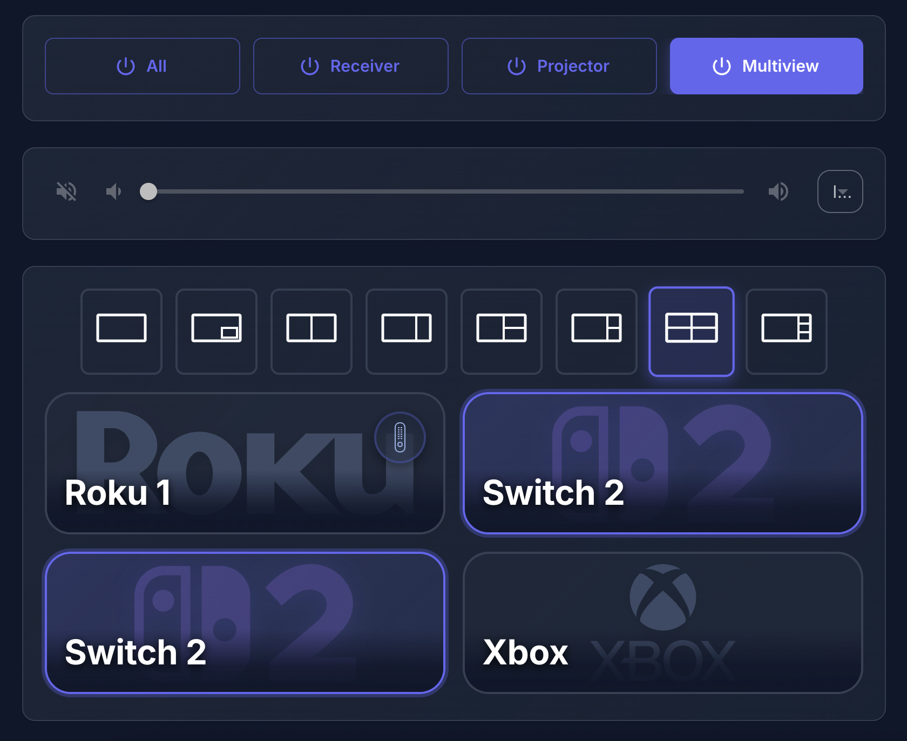

# Home Assistant React Dashboard

A modern, responsive dashboard for Home Assistant built with React, TypeScript, Vite, and Material-UI. This dashboard provides an intuitive interface for controlling home theater equipment including multiview video switchers, receivers, and media players.



## Features

- 🎛️ **Device Power Control** - Turn on/off multiple devices (Receiver, Projector, Multiview)
- 🔊 **Media Player Control** - Volume control with mute functionality for Yamaha receivers
- 📺 **Multiview Layout Management** - Visual interface for OREI UHD 401MV multiview switcher
  - Support for multiple layout modes (Single, PBP, Triple, Quad)
  - Device assignment to different inputs (Roku, Switch, Xbox)
  - Interactive layout preview
- 🎨 **Dark/Light Theme Toggle** - Seamless theme switching with smooth animations
- 📱 **Responsive Design** - Beautiful glassmorphic UI with gradient cards and blur effects

## Tech Stack

- **React 19** - Modern React with hooks
- **TypeScript** - Type-safe development
- **Vite** - Fast build tool and dev server
- **Material-UI (MUI)** - Component library and theming
- **@hakit/components & @hakit/core** - Home Assistant integration components
- **React Router** - Client-side routing

## Prerequisites
Node version manager - [NVM](https://github.com/nvm-sh/nvm) to easily install and manage node versions

## Local Development
## Local Development

1. Install dependencies:
```bash
nvm use && npm i
```

2. Start the development server:
```bash
npm run dev
```

The dev server will start with hot module replacement (HMR) - changes will automatically reload in your browser.

## Dependencies

```json
Node.js >=18.0.0
npm >=7.0.0
```

## Building

Build the production-ready files:
```bash
npm run build
```

This will compile TypeScript and bundle the application. The output will be in the `dist` directory, ready for deployment to your Home Assistant instance.

## Deploy to Home Assistant via SSH

1. Create a `.env` file with your Home Assistant SSH credentials:
```env
VITE_SSH_USERNAME=your_username
VITE_SSH_HOSTNAME=your_homeassistant_hostname
VITE_SSH_PASSWORD=your_password
VITE_FOLDER_NAME=ha-dashboard
```

2. Run the deployment script:
```bash
npm run deploy
```

The script will automatically build and upload the files to your Home Assistant instance. See the [deployment documentation](https://shannonhochkins.github.io/ha-component-kit/?path=/docs/introduction-deploying--docs) for SSH setup instructions.

3. The `VITE_FOLDER_NAME` specifies the folder created on your Home Assistant instance where files will be uploaded.

## Configuration

### Folder Name & Vite Base Path
### Folder Name & Vite Base Path

The `VITE_FOLDER_NAME` environment variable determines both:
- The deployment folder on your Home Assistant instance
- The `base` path in `vite.config.ts` for correct routing when deployed

Changing `VITE_FOLDER_NAME` automatically updates both values to keep them in sync.

### TypeScript Type Sync

Sync your Home Assistant entity types to get autocomplete and type safety:

1. Set up your `.env` file with:
```env
VITE_HA_URL=https://your-homeassistant-url
VITE_HA_TOKEN=your_long_lived_access_token
```

2. The `VITE_HA_URL` must be an HTTPS URL for successful type syncing
3. Generate a long-lived access token following [these instructions](https://shannonhochkins.github.io/ha-component-kit/?path=/docs/introduction-typescriptsync--docs)

4. Run the sync script:
```bash
npm run sync
```

This creates a types file that you can add to your `tsconfig.json` for full type safety with your Home Assistant entities.

### HA Token Security
### HA Token Security

By default, the HA token is only used during local development and by the sync script. 

- **Development only**: Keep token in `.env.development` (default, safer)
- **Production bundle**: Move token to `.env` if you want it bundled with your deployment
  - Remove `.env.development` file
  - Update `scripts/sync-types.ts` to remove the `.env.development` loader

## Available Scripts

- `npm run dev` - Start development server with HMR
- `npm run build` - Build for production
- `npm run lint` - Run ESLint
- `npm run prettier` - Format code with Prettier
- `npm run preview` - Preview production build locally
- `npm run sync` - Sync Home Assistant entity types
- `npm run deploy` - Build and deploy to Home Assistant via SSH

## Project Structure

```
ha-dashboard/
├── src/
│   ├── components/       # Reusable UI components
│   │   ├── DevicePower.tsx
│   │   ├── MediaPlayerControl.tsx
│   │   ├── ModeSelector.tsx
│   │   ├── MultiViewLayout.tsx
│   │   └── ThemeToggle.tsx
│   ├── hooks/            # Custom React hooks
│   │   ├── useLocalStorage.ts
│   │   ├── useMediaPlayer.ts
│   │   └── useSelectEntityMode.ts
│   ├── pages/            # Page components
│   │   └── Basement.tsx
│   ├── resources/        # Static assets
│   ├── App.tsx           # Root component
│   ├── theme.ts          # MUI theme configuration
│   └── main.tsx          # Entry point
├── scripts/
│   ├── deploy.ts         # SSH deployment script
│   └── sync-types.ts     # HA type sync script
└── vite.config.ts        # Vite configuration
```

## Further Documentation

For more information about Home Assistant integration and component usage, visit the [@hakit documentation](https://shannonhochkins.github.io/ha-component-kit/).

## License

Private project

---

Built with ❤️ for Home Assistant
